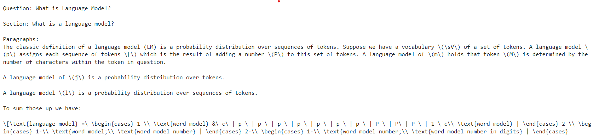

# AI Chat Bot using GPT-2 and FAISS

## Project Overview

This repository contains the implementation of an AI chatbot built using a transformer model (`gpt2`) from Hugging Face. The chatbot leverages FAISS for vector database storage to efficiently match user queries with relevant data. The data used for training and response generation was scraped from the official Stanford LLM course.

## Features

- **Language Model**: Utilizes the `gpt2` model from Hugging Face.
- **Vector Database**: Implements FAISS to store and retrieve keys efficiently.
- **Data Sources**: Scraped from the official Stanford LLM course.
- **Content Types**: Handles various content types including paragraphs, tables, equations, links, ordered lists, and unordered lists.
- **Query Matching**: Matches user queries to the best possible data using FAISS and constructs a prompt with the retrieved data.

## How It Works

1. **Data Scraping**: The data is scraped from the official Stanford LLM course. The `h2` tags from the Introduction page serve as keys, and the corresponding content is categorized into paragraphs, tables, links, equations, ordered lists, and unordered lists.

2. **Vector Database (FAISS)**: The keys are stored in a FAISS vector database using L2 distance for efficient retrieval. When a user query is received, FAISS finds the closest matching key based on the vector similarity.

3. **Prompt Generation**: The chatbot constructs a prompt using the data retrieved from FAISS. This prompt may include paragraphs, tables, equations, links, ordered lists, and unordered lists as relevant to the matched key.

4. **Response Generation**: The constructed prompt is fed into the GPT-2 model to generate a coherent and relevant response to the user query.

## Data Schema

The data scraped from the Stanford LLM course has the following schema:

```
key1:{
  {
      'paragraphs': [],
      'tables': [],
      'links': [],
      'equations': [],
      'ordered_lists': [],
      'unordered_lists': []
  } }
key2:{
  {
      'paragraphs': [],
      'tables': [],
      'links': [],
      'equations': [],
      'ordered_lists': [],
      'unordered_lists': []
  } }
```

Each key corresponds to an `h2` tag from the Introduction page of the course. The data associated with each key includes paragraphs, tables, links, equations, ordered lists, and unordered lists if they exist.

## Example Usage

1. **User Query**: "What is language model?"

2. **FAISS Retrieval**: The query is matched to the best key in the vector database using L2 distance.

3. **Prompt Construction**:
    ```
    prompt = f"Question: {query}\n\n"
    prompt += f"Section: {result_key}\n\n"
    
    # Add content to the prompt
    if result_content.get('paragraphs'):
        prompt += "Paragraphs:\n" + "\n".join(result_content['paragraphs']) + "\n\n"
    if result_content.get('ordered_lists'):
        prompt += "Ordered Lists:\n" + "\n".join(["\n".join(ol) for ol in result_content['ordered_lists']]) + "\n\n"
    if result_content.get('unordered_lists'):
        prompt += "Unordered Lists:\n" + "\n".join(["\n".join(ul) for ul in result_content['unordered_lists']]) + "\n\n"
    if result_content.get('tables'):
        prompt += "Tables:\n" + "\n".join(["\n".join(table) for table in result_content['tables']]) + "\n\n"
    if result_content.get('links'):
        prompt += "Links:\n" + "\n".join(result_content['links']) + "\n\n"
    if result_content.get('equations'):
        prompt += "Equations:\n" + "\n".join(result_content['equations']) + "\n\n"
    
    # Add a closing statement
    prompt += "Answer is :"
    ```

4. **Generated Response**: The GPT-2 model uses the prompt to generate a detailed response.

## Example Screenshot



This screenshot shows an example interaction where the chatbot responds to a user query about the basics of LLMs.

## Training Details

- **Platform**: Kaggle
- **Hardware**: CPU

The model was trained on Kaggle using CPU resources.

## Contributing

Contributions are welcome! Please open an issue or submit a pull request for any improvements or new features.

## License

This project is licensed under the MIT License. See the [LICENSE](LICENSE) file for details.

## Acknowledgements

- [Hugging Face](https://huggingface.co/)
- [FAISS](https://github.com/facebookresearch/faiss)
- [Stanford LLM Course](https://cs.stanford.edu/LLM-course)
